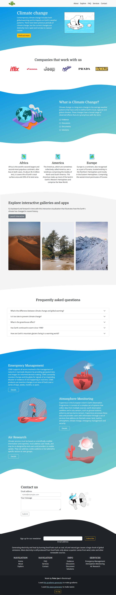

# 🛠 Bootstrap-Climate-Change-page

# 🔗 [Live Preview](https://bootstrap-climate-webpage-page.netlify.app/)

## Welcome! 👋

This is a practice medium-size project that I have designed and built using Bootstrap and a little bit of Sass. Through this project, I am trying to understand and practice Bootstrap as well as Sass combined with it.

### Languages and features 👨‍💻 

- Bootstrap: grid system, components, forms.
- Design: layout, visual appeal, combining colors, asimetrical section transitions.

Thanks for checking out my projects
